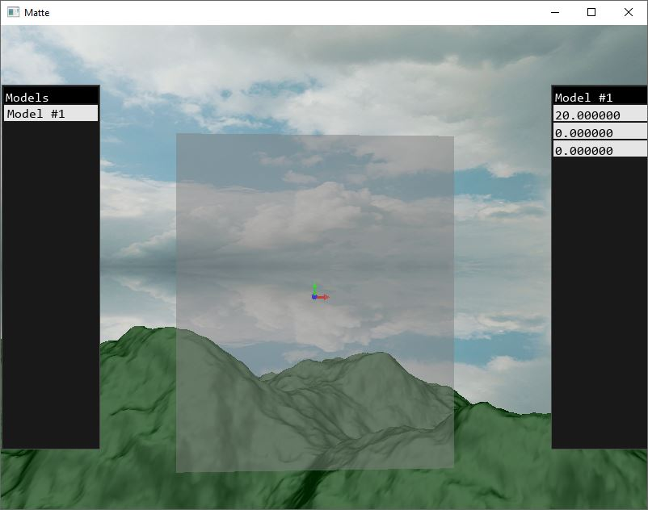
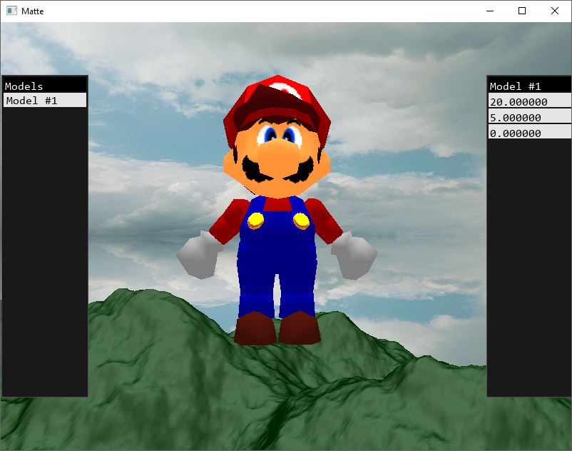

# Building out a 3D engine in OpenGL/GLFW/C++ from Scratch
I've been working on this project for a while now in order to investigate how difficult it is to build a fairly verbose 3D engine in C++ with OpenGL and GLFW. My goal is to eventually strip out any need for third party libraries (other than GLFW and OpenGL). The third party libraries currently in use are:

- Freetype (for reading in .ttf files)
- SOIL (for imaging reading)

All third party libraries are installed via vcpkg on the build machine.

## Capabilities of the Engine
### File Format
The engine reads in `.matte` files, examples of which can be found in the `assets/scenes` directory. These files are in pseudo-json format, with a few exceptions, since I found JSON to be a little to bloated for my use case.

### Models
The engine currently supports the .obj file format. At the moment, there are plans to load .dae files in order to support animation. We currently support texture mapping.

The positions of models can be modified in the world by either selecting the model and subsequently selecting its arrows and dragging:

Or by using the UI to modify the values of the selected model:

### Lights
The engine supports three different kinds of lights: directional, point, and spot, as well as shadow mapping, except spot light. (At one point, spot light shadow mapping was supported, but it has since broken)

### Skyboxes
Skyboxes work using a cube map, made up of six different images

### Skyboxes and Terrain
Terrain is being generated using a variation of Simplex Noise

### Particle Emitters
The engine also features a fairly nuanced particle system, in which users can specify how the color and speed of a particle changes over time. These particles are drawn via instancing, and I've found that 100,000 particles on screen at the same time causes very little slow down.

### UI System
The UI system is currently in its infancy but, as the project progresses, it should become a lot more built-out. In its current state, users are able to edit the location of models in the scene via text input.

### Deferred rendering
The user can turn deferred rendering on in the `.matte` configuration, but some things may break/.

### Soft Shadows using Precentage-Closer Filterig (PCF)
Before PCF, with hard shadows:

After PCF, with smooth shadows (sampling 4x4 grid around the texel):

## Upcoming
1. Animation System
2. Point Light Shadow Maps
3. Writing out the current scene to `.matte` files
4. Better model
5. Removal of slow std library code that's lingering around