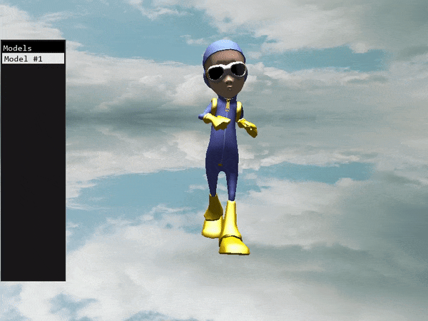
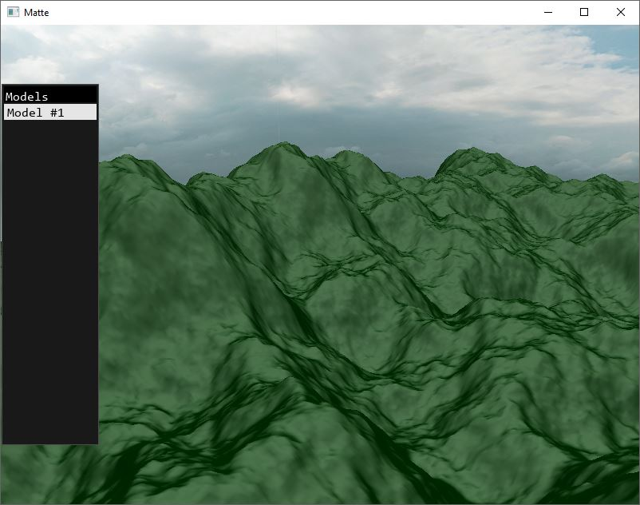
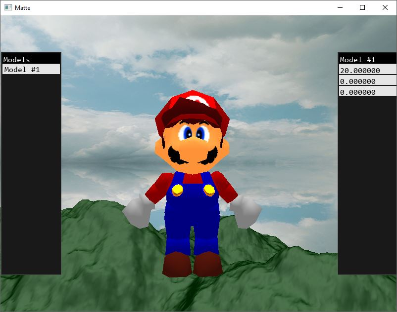
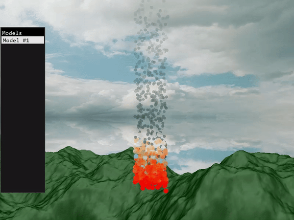
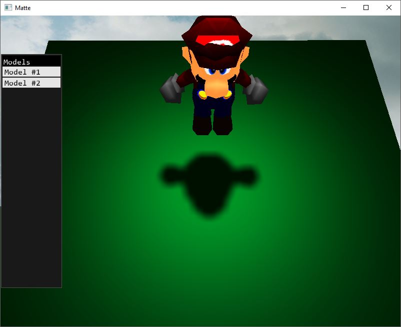

# Building out a 3D engine in OpenGL/GLFW/C++ from Scratch
I've been working on this project for a while now in order to investigate how difficult it is to build a fairly verbose 3D engine in C++ with OpenGL and GLFW. My goal is to eventually strip out any need for third party libraries (other than GLFW and OpenGL). The third party libraries currently in use are:

- Freetype (for reading in .ttf files)
- SOIL (for imaging reading)
- Assimp (for initial file reading)
- GLFW3

All third party libraries are installed via vcpkg on the build machine.

## Implemented Features
### Animation

### Procedural Textured Terran Generation With Normal Maps

### Scene File Format
The engine reads in `.matte` files, examples of which can be found in the `assets/scenes` directory. These files are in pseudo-json format, with a few exceptions, since I found JSON to be a little to bloated for my use case.

### Compact Model Loading
The Model Transform Tool leans on Assimp to directly binary serialize any file format into something that the engine can easily load at runtime. The bounding box of each model is decided during the process as well, making in-world model selection fast and simple.

Users can also modify various properties of a rendered model using the UI:

### Lights
The engine supports three different kinds of lights: directional, point, and spot, as well as shadow mapping, except spot light. (At one point, spot light shadow mapping was supported, but it has since broken)

### Particle Emitters
The engine features a fairly nuanced particle system, in which users can specify how the color and speed of a particle changes over time. These particles are drawn via instancing, and I've found that 100,000 particles on screen at the same time causes very little slow down.

### UI System
The UI System is currently in its infancy, but it allows users to quickly add ways to edit any value in the engine, such as the position, rotation, and scale of models. This comes in handy when we're testing things in real time.

### Soft Shadows using Precentage-Closer Filterig (PCF)
Before PCF, with hard shadows:

After PCF, with smooth shadows (sampling 4x4 grid around the texel):

## Upcoming
1. Refactor ModelTransformationTool code
2. Fix lingering issues with Animation
3. Add better support for hot-reloading of shaders and scenes
4. Implement more game-engine features